## 1. 并发与高并发

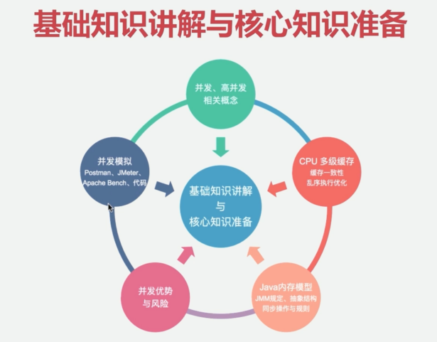

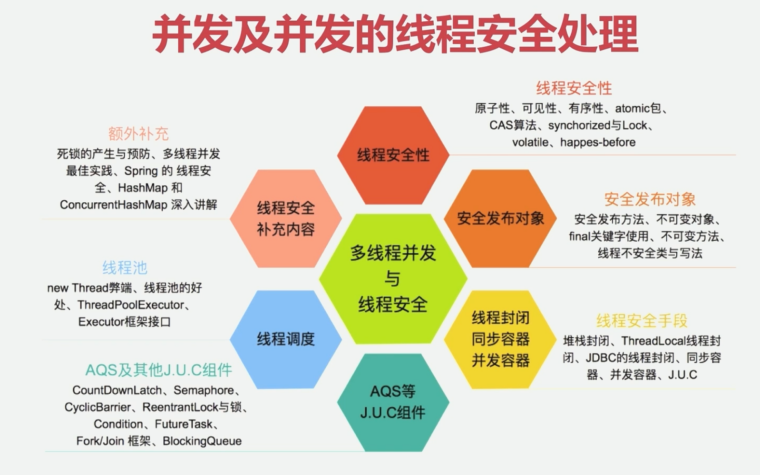

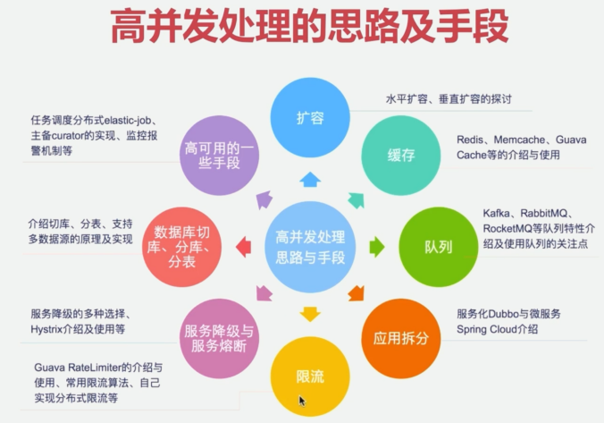

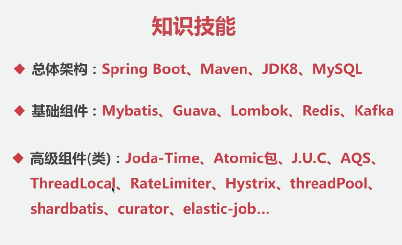

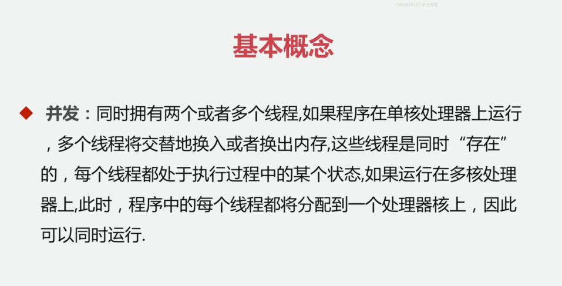

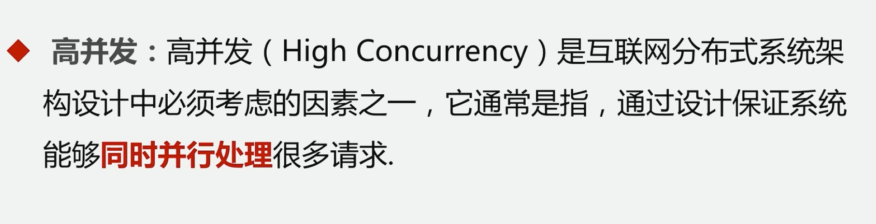

OOM异常：out of memory

## 2. 并发基础

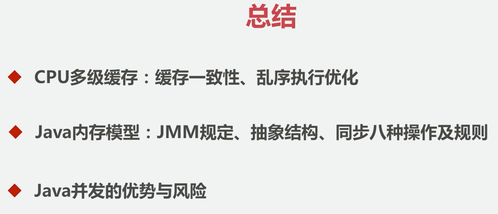

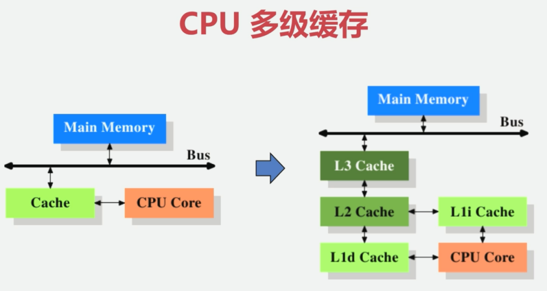

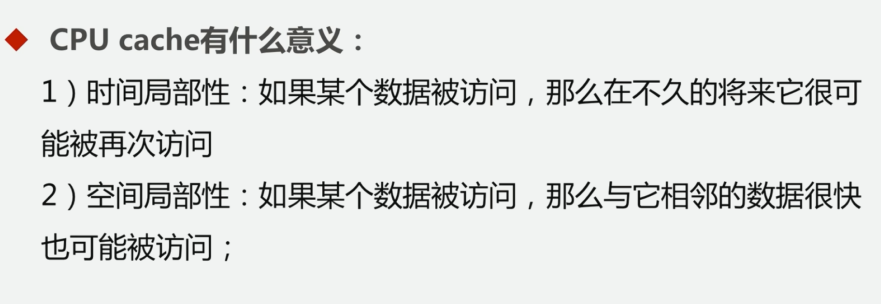

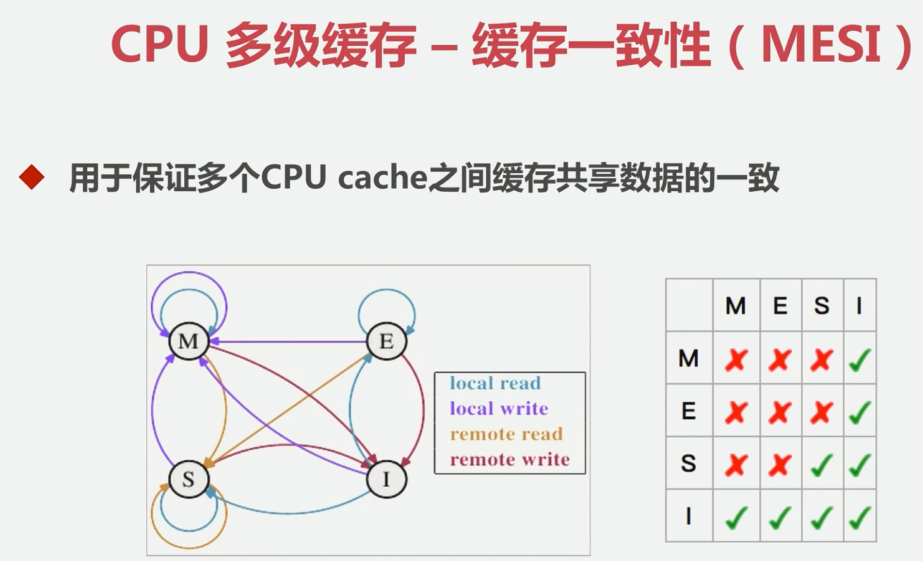

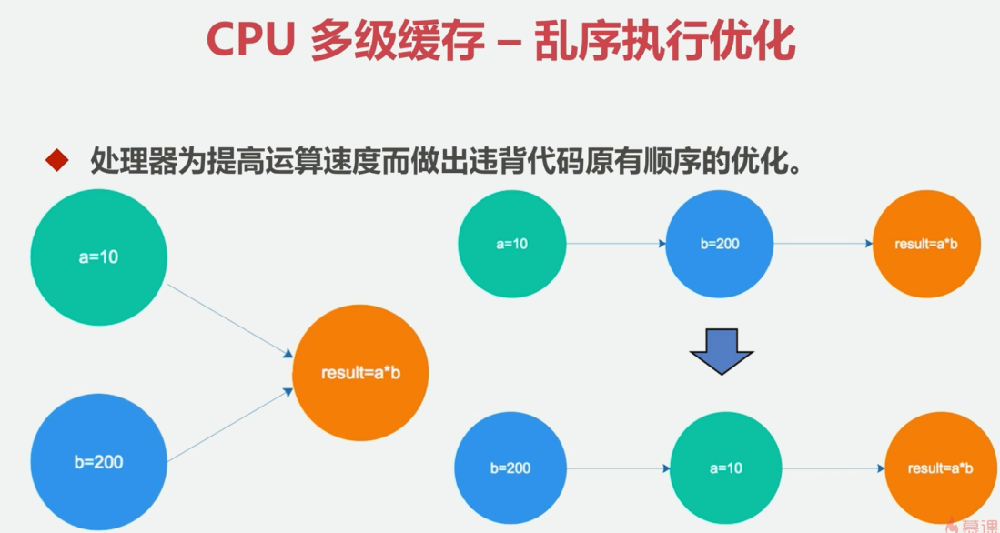

JMM

JVM和JMM的关系

- JMM内存图

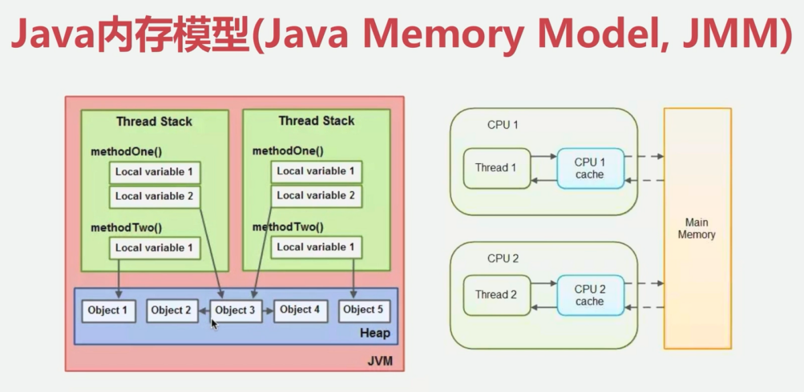

- 硬件内存抽象图

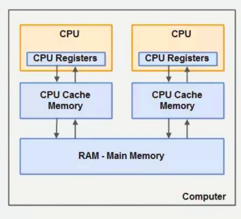

- 关系图

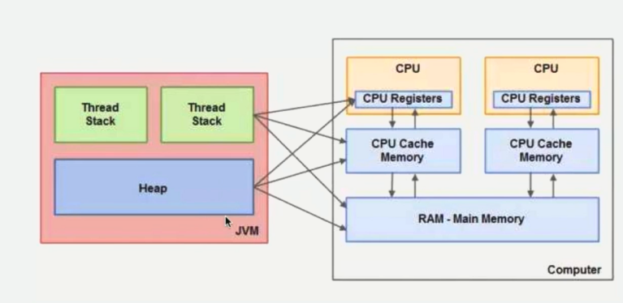

- 为什么会发生不同步的问题：

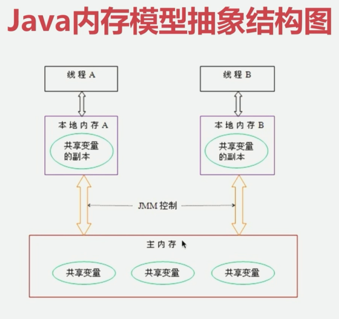

- Java内存模型-同步的八种操作

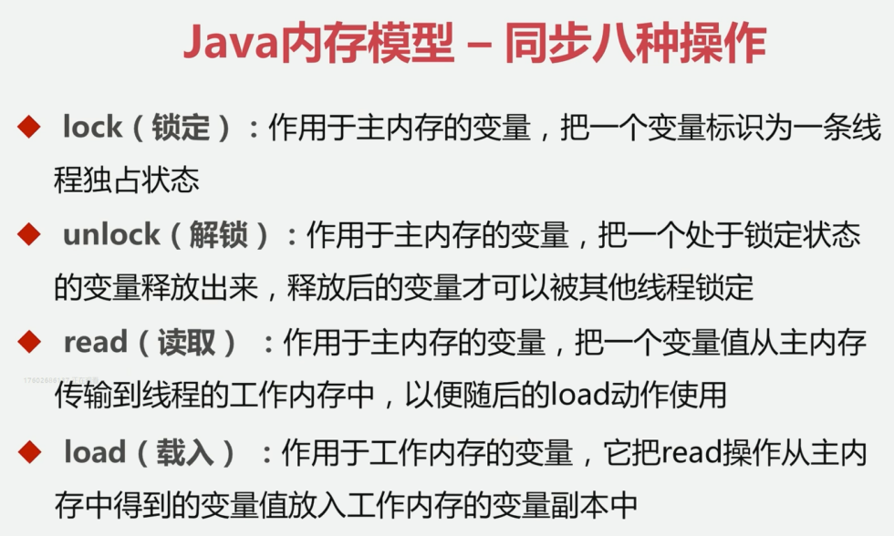

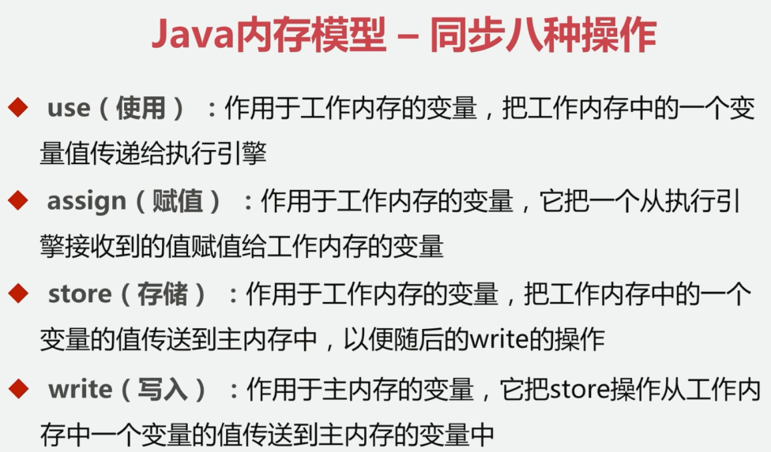

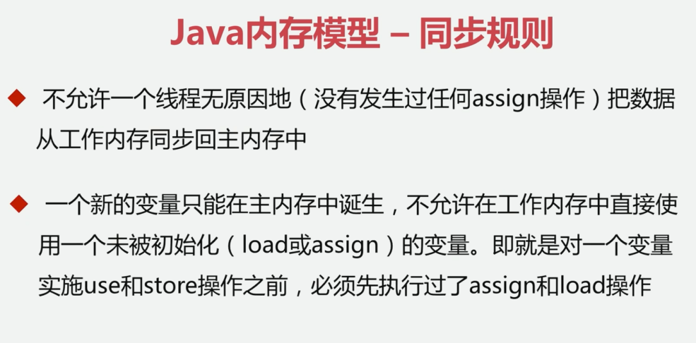

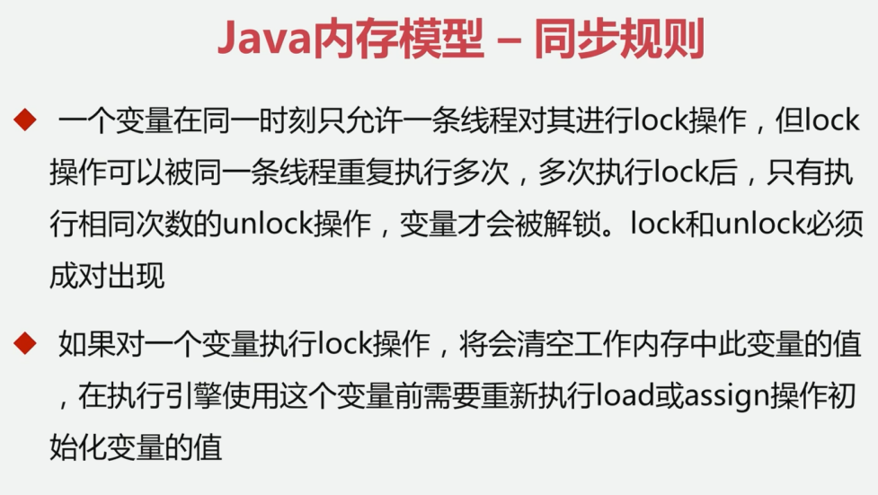

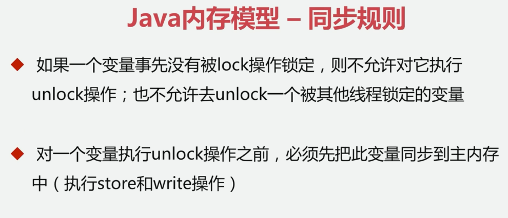

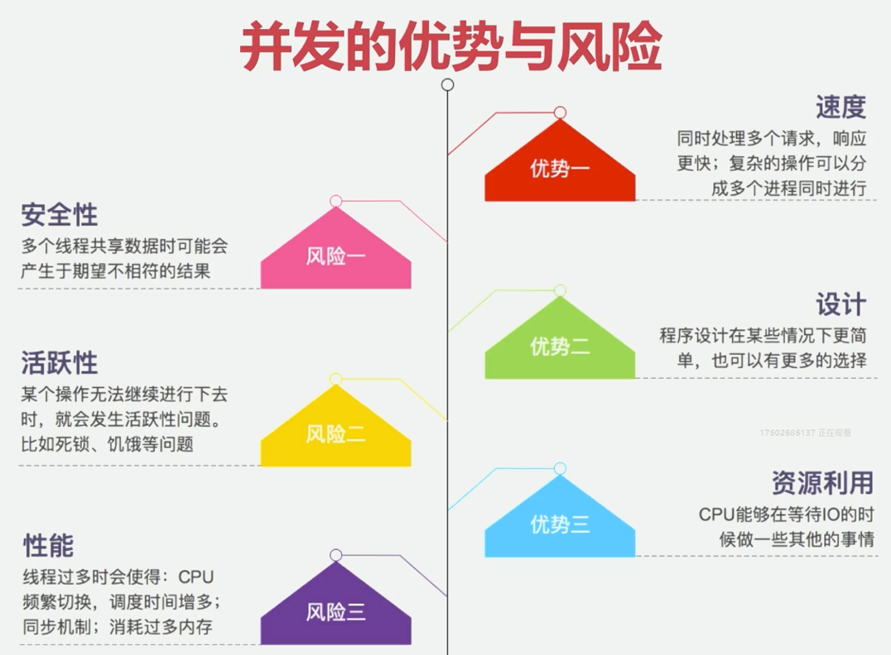

数据访问保护

## 3. 并发编程与线程安全项目准备

- 进程安全

并发环境下得到我们期望的结果；

- 进程不安全

进程由于没有对数据进行数据保护，导致数据为脏数据及错误。

