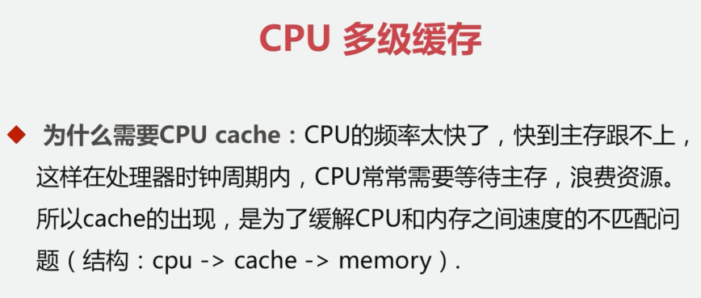
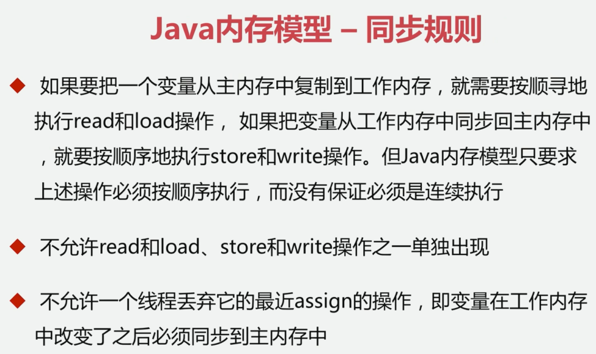
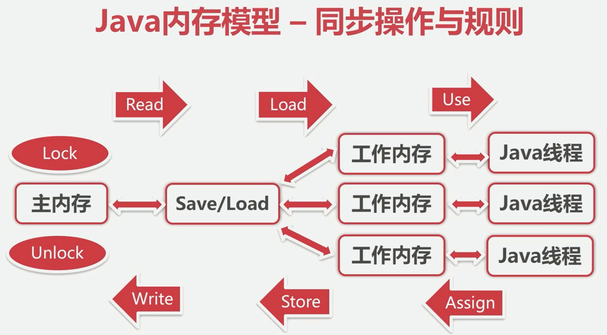

## 1. 并发与高并发

OOM异常：out of memory

## 2. 并发基础

JMM

JVM和JMM的关系

- JMM内存图

- 硬件内存抽象图

- 关系图

- 为什么会发生不同步的问题：

- Java内存模型-同步的八种操作

数据访问保护

## 3. 并发编程与线程安全项目准备

- 进程安全

并发环境下得到我们期望的结果；

- 进程不安全

进程由于没有对数据进行数据保护，导致数据为脏数据及错误。

